# 🚀 AI Closer (`app.aicloser.in`) — Complete End-to-End Feature Masterplaybook, SEO Architecture & Marketing Strategy

> **Platform**: AI Closer CRM (`app.aicloser.in`)  
> **Target Audience**: High-ticket B2B Closers, Sales Agencies, EdTech, Real Estate, Consultancies, and Outbound/Inbound Sales Teams  
> **Source of Truth**: 100% verified against live code in `D:\AIcloser\application`, `apps/crm-mobile`, and `D:\AIcloser\website`.

---

## 📌 Executive Summary

**AI Closer** (`app.aicloser.in`) is an end-to-end, high-velocity Sales Execution & Closer Operating System designed specifically for sales-driven businesses. Unlike traditional bloated CRMs that act as passive data cemeteries, AI Closer is built for **speed to lead**, **live calling telemetry**, **unified WhatsApp & Instagram conversations**, **dynamic UPI payment closing**, and **strict role-based execution**.

The platform is strictly partitioned into three operational roles:
1. **👑 Admin / Business Owner / Founder**: Global governance, channel integrations, automated lead routing, and revenue optimization.
2. **👔 Manager / Sales Supervisor**: Live team monitoring, call recording audits, lead re-distribution, and rep accountability.
3. **🎯 Closer / Sales Rep**: Distraction-free high-conversion cockpit, 1-click SIM calling, Grab Leads queue, and 1:1 omnichannel closing.
4. **📱 Native Android Companion App**: Foreground telephony service, floating Caller-ID overlay, offline sync, and auto call-recording upload.

---

## 🏛️ PART 1: Role-Wise Deep Feature Architecture

```mermaid
graph TD
    subgraph ADMIN["👑 Admin / Business Owner"]
        A1["Workspace & Multi-Tenant Setup"]
        A2["Channel Setup (WhatsApp API, QR, Instagram)"]
        A3["Round Robin & Lead Grab Routing Rules"]
        A4["Team & Role Governance (RBAC & Seat Plans)"]
        A5["Lead Form Builder & Webhook Ingestion"]
        A6["Dynamic UPI Payment Gateway & Pricing Engine"]
        A7["Event & Schedule Automation Workflows Hub"]
        A8["Developer REST API Key Governance"]
    end

    subgraph MANAGER["👔 Manager / Sales Supervisor"]
        M1["Real-Time Team Presence & Device Tracking"]
        M2["Call Recordings & Pitch Quality Audit (1x-3x)"]
        M3["Team CRM Pipeline & 1-Click Lead Reassignment"]
        M4["Responsibility & SLA Breach Matrix (Untouched/Stale)"]
        M5["Missed Calls Recovery Queue & SLA Callback"]
        M6["Payment Proof & UTR Verification"]
        M7["Outbound Calling Campaigns Management"]
    end

    subgraph CLOSER["🎯 Closer / Sales Rep"]
        C1["Personal Kanban Pipeline (My Leads Only)"]
        C2["Grab Leads Fast-Action Queue"]
        C3["Power Dialer with Auto-Advance Cooldown"]
        C4["Lead-IQ AI Intent Scoring & Next-Best-Action"]
        C5["Post-Call Dispositions & Quick Notes"]
        C6["1:1 WhatsApp & Instagram Chat + Voice Notes"]
        C7["Dynamic UPI Payment Links (/pay/[token])"]
        C8["Referral Affiliate Links & 20% Commission Tracker"]
    end

    subgraph MOBILE["📱 Native Android Mobile App"]
        MOB1["Floating Caller-ID Overlay Window"]
        MOB2["Background Call Recording & WorkManager Cloud Upload"]
        MOB3["Millisecond Talk-Time Telemetry (PhoneStateReceiver)"]
        MOB4["Offline-First SQLite/Room Event Sync"]
    end

    ADMIN --> MANAGER
    MANAGER --> CLOSER
    CLOSER <--> MOBILE
```



---

### 👑 1. ADMIN ROLE (Workspace Owner / Business Founder)

The Admin has global control over workspace settings, communication gateways, routing rules, automations, and revenue realization.

#### Core Capabilities & Micro-Features:
1. **Multi-Tenant Workspace Provisioning & Custom Branding**:
   - Secure tenant isolation (`tenantId` scoped queries in PostgreSQL).
   - Brand customization: Workspace Name, Primary Brand Color (`#ff6b2f` default), Currency (`INR`, `USD`), Timezone (`Asia/Kolkata`).
   - Seat license controls: enforcement of active seats (Admins, Managers, Closers) based on subscription plan.
2. **Omnichannel Communication Gateways**:
   - **Meta WhatsApp Business Cloud API**: Embedded signup, verified business number linking, official Meta template synchronization, 2-step verification PIN registration, and HMAC-SHA256 verified webhooks.
   - **Baileys WhatsApp QR Scanner**: Connect normal/unverified WhatsApp numbers via web QR scanner for instant outbound chat and contact scraping.
   - **Instagram Business DM Gateway**: Direct integration with Meta Graph API for receiving and replying to Instagram Direct Messages.
3. **Intelligent Lead Distribution & Routing Engine**:
   - **Weighted Round Robin**: Sequential distribution across active closers with configurable maximum capacity (`maxActiveLeadsPerAgent`).
   - **Lead Grab Pool**: Central holding pool for incoming leads where fastest responding closers can claim leads.
   - **Fallback Assignment**: Auto-routes orphaned leads to a designated manager/admin when closers are offline or at capacity.
   - **Configurable Access Flags**: Toggle non-admin rights for lead modification, deletion, data export, and bulk campaign triggering.
4. **Dynamic UPI Payment Gateway & Pricing Engine**:
   - Configure Business UPI ID (e.g. `agency@icici`), Payee Name, Brand Logo, and custom QR Accent Color.
   - Pricing Formula & Multiplier Builder: `Base Amount × Quantity × Duration` with custom multipliers for Day, Month, Year.
   - Link Validity Rules: set custom expiry timers (15 mins, 1 hour, 1 day, up to 30 days) to create real buying urgency.
   - Policy Control: configure which payment fields are visible/required for Closer vs Customer vs Financial Reports.
   - 1-Click Fraud Proof Approval: review customer-uploaded payment screenshots and UTR reference numbers before marking deals as `PAID`.
5. **Multi-Source Contacts Hub & Lead Capture**:
   - **Spreadsheet Ingestion**: Supports `.xlsx` and `.csv` files with smart header auto-detection (Name, Phone, Email, City, Budget, Notes).
   - **Google Contacts Paste Ingestion**: Paste raw contact text directly without uploading files.
   - **Embeddable Lead Form Builder**: Drag-and-drop web form generator to embed on WordPress, Webflow, Shopify, or Next.js landing pages.
   - **Meta Lead Ads Webhooks**: Instant ingestion from Facebook/Instagram lead forms with zero zapier/third-party middleware fees.
6. **Smart Duplicate Lead Detection & 1-Click Merge (`DuplicateLeadsModal`)**:
   - Scans database for matching phone numbers or emails across import sources.
   - Visual side-by-side comparison of duplicate leads.
   - 1-click merge preserving conversation history, notes, call logs, and stage under the primary lead.
7. **Event & Schedule Automation Workflows Hub (`AutomationWorkflowsPanel`)**:
   - Durable Event & Schedule ➔ Condition ➔ Action pipeline across WhatsApp, stage transitions, and SIM calling.
   - Triggers: `LEAD_CREATED`, `STAGE_CHANGED`, `CALL_COMPLETED`, `CALL_MISSED`, `SCHEDULED_TIME`.
   - Actions: `SEND_WHATSAPP` (with delays), `ASSIGN_AGENT`, `UPDATE_STAGE`, `TRIGGER_WEBHOOK`.
   - Developer REST API Key Generator: generate scoped API tokens (`leads:write`, `calls:sync`, `reports:read`).
8. **Custom Fields & Role-Based Visibility Engine (`CustomFieldsPanel`)**:
   - Define custom fields across Text, Number, Dropdown, Date, and Currency types.
   - Granular field-level permissions: set fields as `READ_WRITE`, `READ_ONLY`, or `HIDDEN` based on user role (e.g., margins hidden from closer).
9. **Custom Status Labels & Colored Badges (`StatusLabelsModal`)**:
   - Create custom status tags with preset colors (Hot, Warm, Cold, High Budget, Decision Maker, Price Sensitive, Urgent).
10. **Global AI Emergency Switch (`GlobalAiToggleButton`)**:
    - Master toggle to pause/resume AI conversational assistants on customer threads across the organization.

---

### 👔 2. MANAGER ROLE (Sales Supervisor / Team Lead)

The Manager ensures rep accountability, monitors live dialing telemetry, audits pitch quality, and handles deal escalations.

#### Core Capabilities & Micro-Features:
1. **Live Team Presence & Hardware Telemetry (`TeamActivityPanel`)**:
   - Real-time rep status: Online, Offline, On Call, Idle.
   - Device hardware monitoring: active Android phone model, battery percentage, app version, network connectivity.
   - Daily KPI leaderboard: Total calls dialed, connected calls, talk time (minutes), and connect rate percentage.
2. **Call Recording Audit & Coaching Player (`CallRecordingPlayer`)**:
   - Synchronized cloud audio playback for every outbound and inbound SIM call.
   - High-fidelity waveform scrubber with 10s skip forward/backward.
   - Variable playback speeds (1.0x, 1.5x, 2.0x, 3.0x) for rapid call quality evaluations.
   - Call disposition review: verifies whether rep tagged the lead honestly vs what transpired on the call.
3. **Responsibility & SLA Breach Matrix (`ResponsibilityReporting`)**:
   - Live exception filters:
     - `untouched`: leads assigned to rep but never dialed or contacted.
     - `overdue`: scheduled follow-ups that passed SLA deadline without call.
     - `stale`: leads sitting idle with >48 hours of zero activity.
     - `missing_follow_up`: contacted leads where rep forgot to set a next action.
   - 1-click drill down to inspect lead history and reassign immediately.
4. **Missed Calls Recovery Queue (`MissedCallsQueue`)**:
   - Real-time queue capturing missed calls from prospects.
   - 1-click WhatsApp automated acknowledgment ("Sorry we missed your call, our advisor is calling you back in 2 minutes").
   - 1-click SIM callback dialer with SLA tracking.
5. **Outbound Calling Campaigns Management (`CallingCampaignsPanel`)**:
   - Create targeted dial lists with daily call targets (e.g. 50/day, 100/day).
   - Set auto-advance cooldowns (e.g. 5s timer) and assign campaigns to specific closers.
   - Monitor live campaign progress: % leads completed, % connected, % converted.
6. **Team Pipeline Management & 1-Click Reassignment**:
   - Filterable CRM Kanban board displaying only leads owned by reporting closers.
   - 1-click lead transfer from slow/inactive closers to top performers.
7. **Team Payment & UTR Proof Verification**:
   - Monitor all payment links generated by reporting closers in real-time.
   - Review uploaded customer payment screenshots, UTR reference numbers, and transaction notes.
   - Track pending vs approved deal revenue across the sales team.

---

### 🎯 3. CLOSER ROLE (Sales Rep / Telecaller / Account Executive)

The Closer role is stripped of all administrative clutter. It is hyper-optimized for two actions: **Talking to Prospects** and **Closing Deals**.

#### Core Capabilities & Micro-Features:
1. **Private Sales Cockpit (Zero Data Leakage)**:
   - Sees strictly their assigned leads. Zero visibility into peers' leads or sensitive company financial settings.
   - Daily Targets Bar: Calls targeted vs dialed today, active opportunities, pending follow-ups due today.
2. **Grab Leads Queue (Gamified Speed-to-Lead)**:
   - Real-time pool of unassigned inbound leads.
   - "Claim Lead" button with instant DB race-condition lock.
   - First rep to click claims lead ownership and it immediately moves to their personal pipeline.
3. **Power Dialer with Auto-Advance Cooldown (`PowerDialerModal`)**:
   - Consecutive lead queue dialing without manual clicking.
   - Active call duration timer and countdown timer for next lead.
   - In-call notes logger and rapid post-call disposition tagging.
4. **Lead-IQ AI Intent Scoring & Next-Best-Action (`LeadIqCard`)**:
   - Intent Score (0–100) and Urgency level (High, Medium, Low).
   - Recommended Next Action for the closer.
   - AI Suggested Call Pitch & WhatsApp Opening Script with 1-click Copy button.
   - AI Objection Buster Matrix: instant rebuttals for common objections (price, timing, trust).
5. **1:1 Unified Social Closing Inbox (`ChatWorkspace`)**:
   - Chat 1:1 with assigned prospects over official WhatsApp and Instagram DMs directly from the CRM card.
   - In-browser Voice Note recording and playback.
   - Emoji picker and Canned Templates / Macros for recurring objection handling.
   - Media and document sharing: send pitch decks, brochures, and payment QR codes directly inside chat.
   - Customer 360 right drawer: update lead stage, write internal notes, and initiate calls without leaving the chat thread.
6. **1-Click Dynamic UPI Payment Links & Instant Chat Checkout**:
   - Generate custom UPI checkout links (`/pay/[token]`) live on call or directly within the WhatsApp/Instagram chat drawer.
   - Real-time pricing formula calculator: auto-computes Base Amount × Quantity × Duration with custom multipliers.
   - Configurable link validity with countdown timer (e.g. 15 mins, 1 hour, 1 day) to create authentic buying urgency.
   - 1-click copy or direct WhatsApp dispatch of the secure payment link.
   - Live link tracking: updates from `PENDING` ➔ `CUSTOMER_CONFIRMED` ➔ `PAID` with commission attribution.
7. **Referral Affiliate Links & 20% Commission Tracker (`ReferralCommissionPanel`)**:
   - Unique closer referral links and tracking tokens.
   - Real-time commission earnings tracker (20% on purchases).
   - In-app 1-click Withdrawal Request (`/api/sales/payouts`) with status tracking.

---

### 📱 4. NATIVE ANDROID MOBILE APP (`apps/crm-mobile`)

The Android companion app gives closers a seamless hardware-backed calling experience:
1. **Floating Caller-ID Overlay Window (`CallOverlayWindow.kt`)**:
   - When an incoming call from a lead rings, a floating overlay card appears on top of the native dialer.
   - Displays Lead Name, Current Stage, Deal Value, and Recent Notes before the rep answers.
2. **Background Call Recording Service (`CallRecordingService.kt`)**:
   - Runs in the background and records both ends of the conversation crystal-clear.
3. **Background Audio Upload Worker (`RecordingUploadWorker.kt`)**:
   - Android WorkManager that automatically compresses and uploads audio recordings to the CRM cloud API (`/api/sales/mobile/call/recording-upload`), with auto-retry on network disconnects.
4. **Millisecond Talk-Time Telemetry (`PhoneStateReceiver.kt`)**:
   - Accurately detects `RINGING`, `OFFHOOK`, and `IDLE` states to log exact talk-time duration without rep guesswork.
5. **Offline-First Event Sync (`OfflineEventStore.kt`)**:
   - When calling in low-connectivity areas, all call outcomes and notes are stored locally in SQLite/Room and synced automatically when internet reconnects.
6. **Instant Post-Call Disposition Popup**:
   - Immediately upon hanging up, a prompt appears on mobile to select stage and record quick notes.

---

### 💳 5. CUSTOMER CHECKOUT EXPERIENCE (`https://app.aicloser.in/pay/[token]`)

Every payment link generated by a closer opens a dedicated, high-converting public checkout page:
1. **Mobile-First Dynamic UPI QR**:
   - Auto-generates high-resolution QR embedded with amount, payee UPI ID, and order reference (`upi://pay?pa=...&am=...`).
   - Compatible with Google Pay, PhonePe, Paytm, CRED, BHIM, and all banking apps.
2. **1-Tap "Open UPI App" Intent**:
   - On mobile devices, prospect taps 1 button to open their favorite UPI app with pre-filled payment details (zero manual typing).
3. **Live Ticking Countdown Expiry**:
   - Visual countdown banner informing customer when the offer/link expires, preventing delayed drop-offs.
4. **Seamless Payment Proof & UTR Submission**:
   - Customer submits their name, phone, optional note, and uploads payment screenshot or enters bank UTR number.
   - Instantly notifies the Closer and Admin dashboard for immediate onboarding.

---

## 🔍 PART 2: High-Intent SEO Architecture & Keyword Strategy

### 🌐 1. SEO Architecture & URL Hierarchy

| Page Type | Target URL | Primary Target Keyword | Search Intent |
| :--- | :--- | :--- | :--- |
| **Home / Platform** | `https://aicloser.in/` | AI Closer CRM, Sales Closing Software | Transactional |
| **Feature: Calling** | `https://aicloser.in/features/calling-crm` | SIM Calling CRM, Outbound Telecalling CRM | Commercial |
| **Feature: Power Dialer** | `https://aicloser.in/features/power-dialer` | Power Dialer Software India, Auto Dialer App | Commercial |
| **Feature: WhatsApp** | `https://aicloser.in/features/whatsapp-crm` | WhatsApp CRM for Sales Teams, Meta WhatsApp CRM | Commercial |
| **Feature: Payments** | `https://aicloser.in/features/upi-payment-collection` | UPI Payment Collection CRM, Instant Payment Links | Commercial |
| **Feature: Routing** | `https://aicloser.in/features/lead-distribution` | Round Robin Lead Distribution Software, Lead Grab CRM | Commercial |
| **Feature: Recordings** | `https://aicloser.in/features/call-recording-crm` | Sales Call Recording CRM, Telecaller Monitoring App | Commercial |
| **Feature: Automations** | `https://aicloser.in/features/sales-automation` | WhatsApp Sales Automation CRM, Drip Workflows | Commercial |
| **Comparison: TeleCRM** | `https://aicloser.in/compare/telecrm-alternative` | Best TeleCRM Alternative, TeleCRM vs AI Closer | High-Intent Alternative |
| **Comparison: LeadSquared**| `https://aicloser.in/compare/leadsquared-alternative` | LeadSquared Alternative for Startups | High-Intent Alternative |
| **Comparison: Close.com** | `https://aicloser.in/compare/close-crm-alternative` | Close CRM Alternative India / Asia | High-Intent Alternative |
| **Role Landing Page: Closer** | `https://aicloser.in/for/sales-closers` | CRM for High Ticket Closers | Solution / Persona |
| **Role Landing Page: Agency** | `https://aicloser.in/for/marketing-agencies` | Agency Client Lead Distribution CRM | Solution / Persona |

---

### 🔑 2. High-Value Keyword Clustering

#### Cluster A: Telecalling & Mobile SIM CRM (Volume: ~18,000/mo)
- `sim based calling crm`
- `telecalling software with mobile app`
- `automatic call recording crm for sales team`
- `telecrm alternative india`
- `caller id popup crm for android`
- `power dialer software for sales team`
- `offline calling crm app`

#### Cluster B: WhatsApp & Omnichannel CRM (Volume: ~24,500/mo)
- `whatsapp crm for sales teams`
- `official meta whatsapp cloud api crm`
- `whatsapp and instagram unified inbox crm`
- `bulk whatsapp marketing crm with templates`
- `whatsapp voice notes in crm`
- `whatsapp lead capture and auto assignment`

#### Cluster C: Dynamic UPI Payment Collection & Checkout (Volume: ~14,800/mo)
- `upi payment collection crm`
- `sales closer payment links software`
- `dynamic upi qr code crm india`
- `send upi payment link on whatsapp crm`
- `crm with payment screenshot proof verification`
- `instant payment checkout for sales telecallers`

#### Cluster D: Speed to Lead & Lead Routing (Volume: ~9,200/mo)
- `round robin lead distribution software`
- `lead grab crm for sales reps`
- `automatic lead assignment crm`
- `fastest lead response crm`
- `lead distribution to multiple closers`
- `sla breach lead tracking software`

#### Cluster E: Sales Intelligence & AI CRM (Volume: ~8,100/mo)
- `crm for high ticket closers`
- `sales closer management software`
- `telecaller monitoring app for managers`
- `ai lead scoring and next best action crm`
- `duplicate lead detection and merge crm`

---

## 📢 PART 3: High-Converting Marketing Angles & Ad Copy Swipefile

```
┌─────────────────────────────────────────────────────────────────────────────┐
│                       THE AI CLOSER VALUE FORMULA                           │
│                                                                             │
│   Speed to Lead (< 60 Sec)  +  Omnichannel Reach (Call + WA + IG)           │
│   ─────────────────────────────────────────────────────────────  =  3X ROI  │
│          Zero Rep Admin Work  +  100% Manager Accountability                │
└─────────────────────────────────────────────────────────────────────────────┘
```

---

### 🎯 1. Marketing Angle: "Speed to Lead" (For Inbound Agency & EdTech Founders)
- **Target Persona**: Founders spending ₹1L–₹10L/month on Meta Lead Ads whose reps contact leads 4 hours later.
- **Hook**: *"A lead contacted in 5 minutes is 21x more likely to convert. Why is your team waiting 3 hours?"*
- **The Problem**: Leads sit in Facebook Lead Center or Google Sheets. Closers pick easy leads and ignore tough ones. Money is burned.
- **The AI Closer Solution**: Instant webhook ingestion ➔ Instant Round Robin distribution or push to Grab Leads pool ➔ Rep's mobile rings immediately with floating Caller ID ➔ 1-click SIM dial with call recorded.
- **Ad Copy Snippet**:
  > *Stop donating ad budget to Meta. With AI Closer, the moment a prospect fills your ad form, it lands in your closer’s phone within 3 seconds. 1-click dial. Zero manual data entry. 100% call recording.*

---

### 🎯 2. Marketing Angle: "The WhatsApp Asset Protection" (For Indian & Global SMBs)
- **Target Persona**: Businesses whose 90% customer conversations happen on WhatsApp personal accounts.
- **Hook**: *"Your sales reps are talking to high-value clients on their private WhatsApp. What happens when they quit?"*
- **The Problem**: Client chats, negotiations, and phone numbers belong to the rep. Business owner has zero visibility and loses customers when reps leave.
- **The AI Closer Solution**: Centralized Official Meta Cloud API + Shared Inboxes. Every WhatsApp message, voice note, and media document stays inside the company CRM forever.
- **Ad Copy Snippet**:
  > *Own your customer relationships. AI Closer unifies your WhatsApp Business API and Instagram DMs into one enterprise dashboard. Closers chat, managers monitor, and client data stays 100% secure in your workspace.*

---

### 🎯 3. Marketing Angle: "Manager Peace of Mind" (For Sales Heads & Supervisors)
- **Target Persona**: Sales Managers tired of asking *"Kitne calls kiye aaj?"* (How many calls did you make today?)
- **Hook**: *"Never ask your team for daily calling reports again."*
- **The Problem**: Reps forge Excel sheets claiming they called 60 leads when they only called 15 for 20 seconds.
- **The AI Closer Solution**: Automatic hardware-backed call logs. The app records start time, exact talk duration, and uploads the audio recording to the manager’s dashboard automatically.
- **Ad Copy Snippet**:
  > *Listen to real sales pitches, not excuses. AI Closer logs every SIM call duration automatically and lets managers listen to full recordings at 2x speed. Spot weak pitches, train closers faster, and double your close rates.*

---

### 🎯 4. Marketing Angle: "Zero Payment Drop-Off Closing" (For High-Ticket Closers & Agencies)
- **Target Persona**: Businesses losing 25–40% of verbal commitments between "Send me the QR" and actual payment.
- **Hook**: *"90% of deals die in the gap between 'Main payment kar deta hoon' and the actual transaction. Stop sending static QR screenshots."*
- **The Problem**: Sales rep sends a generic static UPI QR code on WhatsApp. The prospect gets distracted, delays payment, and goes cold. The rep spends days chasing them for bank UTR numbers.
- **The AI Closer Solution**: The closer generates a dynamic, time-limited payment link (`/pay/[token]`) directly during the sales call. The customer clicks "Open UPI App", selects GPay/PhonePe, pays the pre-filled amount in 5 seconds, and submits payment proof. Deal is locked before they hang up.
- **Ad Copy Snippet**:
  > *Never let a hot prospect go cold. With AI Closer, your reps generate dynamic UPI checkout links with live countdown timers directly on the sales call. Prospects open Google Pay or PhonePe in 1 tap, pay instantly, and your deal is closed on the spot.*

---

## 🥊 PART 4: Competitor Feature Comparison Table

| Capability | AI Closer (`app.aicloser.in`) | TeleCRM | Close.com | LeadSquared | HubSpot Free/Starter |
| :--- | :---: | :---: | :---: | :---: | :---: |
| **Native SIM Calling (Mobile App)** | ✅ Yes (Zero VOIP cost) | ✅ Yes | ❌ VOIP Only (Expensive) | ⚠️ Partial (Add-on) | ❌ VOIP Only |
| **Floating Caller-ID Overlay on Mobile** | ✅ Yes (Lead Name + Notes) | ⚠️ Basic | ❌ No | ⚠️ Add-on | ❌ No |
| **Cloud Call Recording Audio Scrubber** | ✅ Yes (1x–3x speed) | ⚠️ Basic Player | ✅ Yes | ⚠️ Complex setup | ❌ Paid Enterprise only |
| **Dynamic UPI Payment Links & Checkout** | ✅ Native (`/pay/[token]`) | ❌ No | ❌ No | ❌ No (Stripe/Razorpay only) | ❌ No |
| **Payment Screenshot Proof & UTR Approval** | ✅ 1-Click Verification | ❌ No | ❌ No | ❌ No | ❌ No |
| **Power Dialer with Auto-Advance Cooldown**| ✅ Built-in | ⚠️ Basic | ✅ Yes | ⚠️ Paid Add-on | ❌ No |
| **Missed Call Auto-Recovery Queue** | ✅ 1-Click Ack + SLA | ⚠️ Basic | ❌ No | ⚠️ Complex | ❌ No |
| **Lead-IQ AI Intent Scoring & Scripts** | ✅ Built-in | ❌ No | ⚠️ Basic | ❌ No | ❌ Paid Tier |
| **WhatsApp Meta Cloud API + Templates** | ✅ Native & Built-in | ⚠️ Extra Setup | ❌ Third-party only | ⚠️ Costly Integration | ❌ Third-party add-on |
| **Instagram DM Live Closing Inbox** | ✅ Yes (Native) | ❌ No | ❌ No | ❌ No | ⚠️ Basic Social |
| **Instant Lead Grab Queue (Gamified)** | ✅ Built-in | ❌ No | ❌ No | ❌ No | ❌ No |
| **Weighted Round Robin Auto Distribution** | ✅ Built-in | ⚠️ Basic | ⚠️ Rules only | ✅ Yes | ❌ Paid Pro Tier |
| **Spreadsheet & Google Contacts Import**| ✅ 1-Click Auto-Detect | ⚠️ Basic CSV | ✅ Yes | ✅ Yes | ⚠️ Manual Mapping |
| **Duplicate Lead Detection & 1-Click Merge**| ✅ Built-in Modal | ⚠️ Basic | ✅ Yes | ✅ Yes | ❌ Paid Pro Tier |
| **Closer Commission & Deals Tracker** | ✅ Built-in (20% Rules) | ❌ No | ⚠️ Add-on | ⚠️ Complex | ❌ No |
| **Modern Fast Web UI (Next.js / Dark Mode)**| ✅ Sub-second speeds | ⚠️ Dated Legacy UI | ✅ Fast | ⚠️ Slow Enterprise | ⚠️ Heavyweight |
| **Pricing for Emerging Teams** | 💰 Affordable / Scalable | 💰 Mid | 💸 High ($49–$139/seat) | 💸 High Enterprise | 💸 Huge jumps |

---

## 📊 PART 5: Recommended Action Plan for Maximum SEO & Lead Generation

1. **Deploy Feature Landing Pages on `aicloser.in`**:
   - Create dedicated subpages under `website/app/features/` utilizing the exact feature copy and keywords outlined above (`/features/calling-crm`, `/features/power-dialer`, `/features/upi-payment-collection`, `/features/whatsapp-crm`).
2. **Launch "TeleCRM vs AI Closer" Comparison Hub**:
   - Target high-buyer intent keywords like *"telecrm pricing vs ai closer"*, *"best alternative to telecrm"*.
3. **Run Meta Lead Generation Ads Targeting Sales Directors**:
   - Use the "Speed to Lead", "Manager Peace of Mind", and "Zero Payment Drop-Off" hooks with video product tour mockups showing the live dashboard.
4. **Publish Technical SEO Schema Markup**:
   - Implement `SoftwareApplication` and `FAQPage` schema on `aicloser.in` highlighting SIM calling, WhatsApp CRM, and round-robin features.

---
*Document generated and verified against live code in `D:\AIcloser\application`, `apps/crm-mobile`, and `app.aicloser.in`.*
